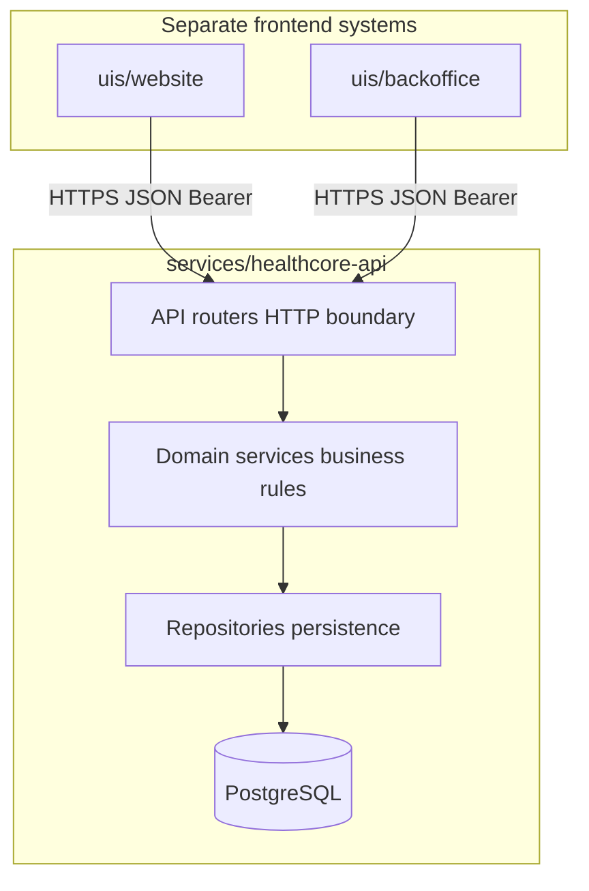
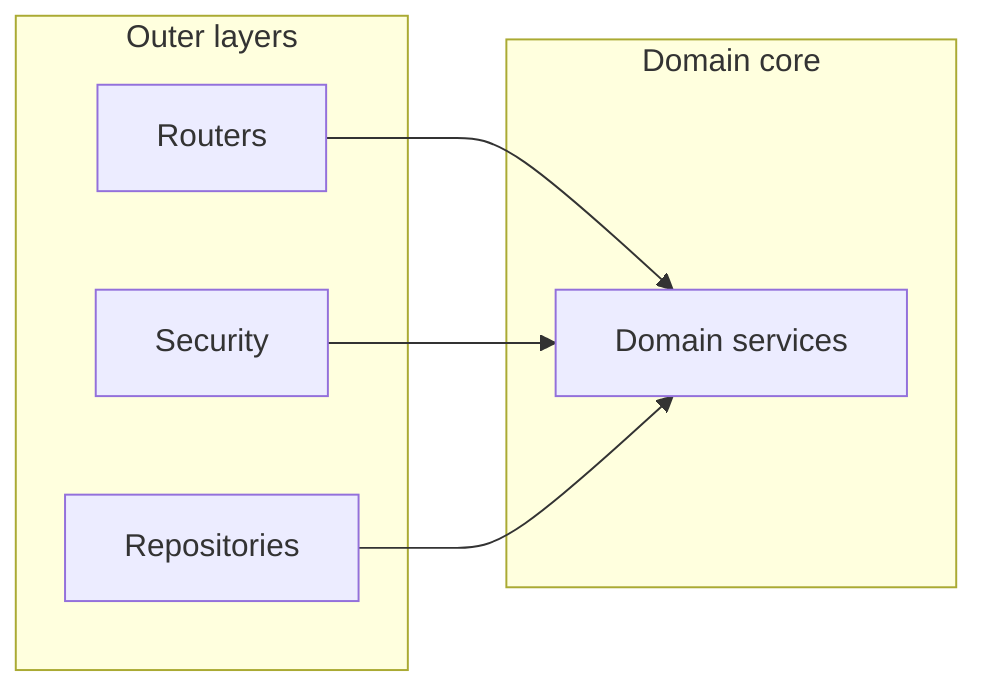

# HealthCore Backend Architecture Proposal

**Audience:** HealthCore Digital (James Osei, CTO) and the engineering team  
**Author intent:** Decision document before environment setup and first endpoints  
**Status:** Proposed — no code yet  
**Date:** 2026-07-31

---

## 1. Purpose and scope

Before we stand up containers, databases, or routes, the team needs a shared answer to four questions:

1. What architectural pattern are we using, and why does it fit HealthCore?
2. How do we organise modules and domains inside that pattern?
3. What initial technical decisions lock in for the next sprint?
4. Where will people get confused, and what are we deliberately *not* deciding yet?

This document answers those questions. It is **not** an OpenAPI spec, a schema dump, a Terraform plan, or a sprint estimate. It is the reasoning layer that those artefacts should inherit.

### Grounding in what we already know

HealthCore is a 12-clinic outpatient network (US + UK), ~200 staff, ~$28M revenue. Pain points that already show up in our Milestone 2 domain models are the ones the backend must serve first:

| Pain | Owner | Domain signal already in the repo |
|------|-------|-----------------------------------|
| ~14% claim denial rate | Revenue Cycle (Tom Callahan) | `Claim`, denial analytics |
| ~22% no-show rate | Patient Experience (Priya Nair) | `Appointment`, no-show cost |
| CME / licence tracking on spreadsheets | People & Workforce (Diane Foster) | `Clinician`, `CMEReport` |
| HIPAA (US) / UK GDPR | Compliance (Claire Whitfield) | Cross-cutting constraint on all data |
| Fragmented systems, no shared data layer | Technology (James Osei) | Why this API exists at all |

Frontends already exist as **separate systems**: `uis/website` (public) and `uis/backoffice` (internal). Business logic today lives as TypeScript under root `src/`. Repo rules require APIs under `services/`.

---

## 2. Proposed architectural pattern

### Decision: domain-driven modular monolith on FastAPI

We propose a **single FastAPI application** deployed as one service, organised internally as a **modular monolith**: code grouped by **business domain**, each domain layered as **router → service → repository**.



**Dependency rule:** infrastructure and HTTP depend on domain services; domain services never import FastAPI or SQLAlchemy details. That is the practical core of “clean architecture” without requiring a full hexagonal ceremony on day one.

### Why this pattern fits what we are building

1. **Team size.** Technology is six people. A microservice fleet (claims-svc, appointments-svc, …) would consume more operational bandwidth than product bandwidth. A modular monolith gives domain boundaries without deployable sprawl.
2. **Domain shape already known.** Milestone 2 already named the aggregates: locations, claims, appointments, clinicians. Organising folders by those names matches how Revenue Cycle, Patient Experience, and Workforce talk about the work.
3. **FastAPI conventions.** Larger FastAPI projects commonly use APIRouter-per-feature with service and repository layers. This is what the team will find in current FastAPI guidance — not a novel invention.
4. **Future extraction without redesign.** If analytics or reminders later need a different scale profile, a domain module with clear boundaries can be extracted. Microservices later; modular monolith now.
5. **Separate frontends.** Website and backoffice are already independent Next.js apps. A dedicated HTTP API is the correct seam — not embedding Python into Next.js, and not inventing a second BFF that reimplements business rules.

### Patterns we considered and rejected (for now)

| Pattern | Why not now |
|---------|-------------|
| Flat “by file type” (`routers/`, `models/`, `schemas/` only) | Fine for a tutorial; collapses when a second domain appears. We already have four. |
| Full hexagonal / ports-and-adapters with many interfaces | Correct dependency direction, but heavy ceremony for the first sprint. We keep the *rule*; we skip the boilerplate until a domain actually needs multiple adapters. |
| Microservices from day one | Premature. Different scaling shapes are not proven. Dual EHRs and dual billing are *external* fragmentation; copying that into our own deployables would multiply failure modes. |
| Django monolith | Excellent batteries-included stack, but we already chose FastAPI for typed OpenAPI-first APIs and async I/O that will matter for analytics and later agent/workflow callers. |
| Node/TypeScript backend to reuse `src/` | Tempting for code sharing. Rejected because upcoming consumers (Python workers, n8n, agents, data pipelines) are not TypeScript-native, and PHI-adjacent analytics should not remain browser-owned. |

---

## 3. Folder and module structure

### Service location

Per monorepo rules, the API lives under `services/`, not under `uis/`:

```text
services/
└── healthcore-api/                 # one deployable service
    ├── README.md
    ├── pyproject.toml
    ├── Dockerfile
    ├── docker-compose.yml          # local API + Postgres
    ├── alembic/
    ├── tests/
    └── src/
        └── healthcore_api/
            ├── main.py             # FastAPI() + include_router
            ├── config.py
            ├── database.py
            ├── dependencies.py
            ├── exceptions.py
            ├── api/
            │   └── router.py       # aggregates domain routers
            ├── security/           # auth, scopes, redaction helpers
            ├── shared/             # kernel: types, pagination — no domain imports
            └── domains/
                ├── locations/
                ├── patients/
                ├── appointments/
                ├── claims/
                ├── clinicians/
                └── analytics/
```

Each domain package contains the same internal layers:

```text
domains/<name>/
├── router.py       # HTTP only: status codes, DI, call service
├── service.py      # business rules and orchestration
├── repository.py   # SQL / persistence
├── schemas.py      # Pydantic request/response DTOs
├── models.py       # SQLAlchemy ORM models
└── exceptions.py   # domain-specific errors
```

### Domain boundaries mapped to the company

| Domain | Owns | Primary stakeholder | Notes |
|--------|------|---------------------|-------|
| `locations` | Clinics, fees, hours metadata | Clinical Ops / Technology | Reference data other domains hang off `locationId` |
| `patients` | Patient identity needed for ops (not full EHR chart) | Patient Experience / Compliance | Minimum necessary fields; PHI classification critical |
| `appointments` | Scheduling lifecycle, no-show status | Patient Experience | Feeds no-show analytics |
| `claims` | Submission, status, denial reason, resubmit | Revenue Cycle | US-heavy initially; UK billing is a later concern |
| `clinicians` | Roles, licences, CME hours | People & Workforce | CME reports live here or via analytics |
| `analytics` | Read-side aggregations (denial rate, no-show cost, CME compliance) | Executive / all leads | **No writes**; composes other domains via services/repos |

**Why a separate `analytics` domain?** Milestone 2 already proved these are first-class product questions (“what is our no-show rate this week?”). Keeping aggregations in a read module prevents stuffing reporting into every write router. It also makes it obvious when analytics load should move off the transactional database later.

**Why not put CME under `analytics` only?** CME status changes clinician compliance state; the write model belongs with `clinicians`. Analytics *reads* that state.

---

## 4. Route and API organisation

### Conventions

- Versioned public API under `/api/v1`
- Plural resource nouns
- State transitions as sub-resources, not query-string verbs
- Analytics as read-only resources
- Unversioned ops probes: `/health`, `/ready`

### Initial route map (illustrative, not a full OpenAPI)

| Method | Path | Domain | Purpose |
|--------|------|--------|---------|
| GET | `/api/v1/locations` | locations | List clinics |
| GET | `/api/v1/locations/{id}` | locations | Clinic detail |
| GET/POST | `/api/v1/patients` | patients | List / create (scoped) |
| GET | `/api/v1/patients/{id}` | patients | Patient detail |
| GET/POST | `/api/v1/appointments` | appointments | List / schedule |
| PATCH | `/api/v1/appointments/{id}/status` | appointments | Confirm, complete, no-show, cancel |
| GET/POST | `/api/v1/claims` | claims | List / submit |
| POST | `/api/v1/claims/{id}/resubmit` | claims | Resubmission workflow |
| GET/POST | `/api/v1/clinicians` | clinicians | Workforce registry |
| GET | `/api/v1/clinicians/{id}/cme` | clinicians | CME report for one clinician |
| GET | `/api/v1/analytics/denial-rates` | analytics | Network / payer / location denial rates |
| GET | `/api/v1/analytics/no-show` | analytics | Rates and cost windows |
| GET | `/api/v1/analytics/cme-compliance` | analytics | At-risk / expiring licences |

### Frontend ↔ backend contract

Frontends remain separate deployables. The API is the contract.

| Concern | Decision | Why |
|---------|----------|-----|
| Transport | HTTPS + JSON | Universal for web, agents, and later workers |
| Auth | OAuth2 bearer tokens (not cookie sessions shared with Next.js) | Clean separation of origins; works for non-browser clients |
| CORS | Explicit allowlist for website and backoffice origins | Public site ≠ internal console |
| Types | Publish OpenAPI; generate TypeScript clients for UIs | Avoid hand-duplicating enums and DTOs |
| Next.js Route Handlers | Thin BFF proxies only | Must not become a second place for denial/no-show formulas |



Arrows mean “depends on.” Domain services do not depend on routers or the ORM.

---

## 5. Initial technical decisions

| Decision | Choice | Why | Explicit alternative rejected |
|----------|--------|-----|-------------------------------|
| Language / runtime | Python 3.12 | FastAPI ecosystem, data/ML/agent adjacency, team programme track | Node backend solely to reuse TS |
| Framework | FastAPI | OpenAPI-first, async, typed validation | Flask (less structure), Django (heavier for pure API) |
| Validation | Pydantic v2 | Shared request/response models with FastAPI | Marshmallow |
| ORM | SQLAlchemy 2.0 async + Alembic | Mature migrations, clear repository layer | Raw SQL only; Tortoise |
| Database | PostgreSQL | Relational fit for claims/appointments; strong ops story | MongoDB (weak for relational analytics) |
| Local env | Docker Compose (API + Postgres) | Reproducible for a distributed student/team setup | “Install Postgres yourself” |
| Lint / types | ruff + mypy | Fast feedback, catches enum drift early | Flake8 alone |
| Tests | pytest + httpx | Async API testing without a browser | Manual Postman as the only gate |
| Logging | structlog JSON with PHI redaction helpers | Claire Whitfield’s compliance bar | `print` / unstructured logs |
| Authn/z | OAuth2 bearer + role scopes | Separate public vs backoffice vs ops roles | Wide-open demo endpoints in production paths |

### Critical decision: backend owns business logic

**Today:** Milestone 2 analytics live in TypeScript (`src/utils/transformations.ts` and related modules). The backoffice imports them client-side.

**Proposal:** Port those rules into Python domain services (`analytics` + `clinicians` / `claims` / `appointments`). Frontends call HTTP endpoints. Root `src/` TypeScript becomes **frontend-legacy**, with a stated deprecation window after API parity tests pass.

**Why this change is required**

1. Denial and no-show analytics operate on PHI-adjacent operational data. Running them only in the browser cannot enforce HIPAA minimum-necessary access.
2. Later programme milestones introduce agents, telemetry, and workflows that will not import a Next.js bundle.
3. One formula in two languages *will* drift; the durable owner must be the API.

**Impact on agent rules:** This proposal **supersedes** the spirit of `.agents/rules/src-import-only.md` for long-term ownership. That rule correctly forbade *duplicating* formulas into UI folders while `src/` was the source of truth. Once the API owns the formulas, the rule should be amended to: *do not reimplement analytics in UIs; call the API; do not edit deprecated TS formulas except for parity fixes during migration.*

Until the port is complete, keep serving the backoffice from TS imports so demos do not break — but treat new feature work as API-first.

---

## 6. Compliance, residency, auth, and audit

### Data residency: deployment, not a column

HealthCore operates under **HIPAA (US)** and **UK GDPR** simultaneously. Claire Whitfield’s authority is organisationally real; architecture must not invent a clever shortcut she will reject.

**Decision:** one shared codebase, **separate deployments and separate databases** for US and UK regions.

| Approach | Verdict |
|----------|---------|
| Single global DB with a `region` column | **Rejected.** Too easy to query across jurisdictions; residency becomes a filter you forget. |
| Separate US / UK deployments + DBs, same image | **Chosen.** Residency enforced by topology. |
| Fully separate codebases | Rejected. Doubles every feature cost for a six-person team. |

**Reopen trigger for single-DB:** only if Compliance issues a written exception for a specific non-PHI reference dataset (e.g. public clinic directory). Operational PHI stays split.

### Auth and RBAC (initial roles)

| Role | Typical actor | Access sketch |
|------|---------------|---------------|
| `public` | Anonymous / patient enquiry | Locations list; enquiry submission only — no analytics |
| `ops_analyst` | Backoffice staff | Read analytics, appointments, claims summaries |
| `revenue` | Revenue Cycle | Claims write paths, denial detail |
| `workforce` | People & Workforce | Clinician / CME write paths |
| `admin` | HealthCore Digital | Config, user/role management |

Exact scope matrix can refine in sprint zero; the architecture requirement is that **scopes live in the API**, not only in the UI hiding buttons.

### Audit

- Structured logs for authentication failures and claim/appointment state changes
- No PHI in log bodies or OpenAPI examples (synthetic fixtures only)
- Prefer immutable audit rows for claim status transitions when write APIs land

---

## 7. Risks and points of attention

| Risk | Why it will confuse the team | Mitigation |
|------|------------------------------|------------|
| TS vs Python logic drift | Two copies of denial/no-show/CME math | Shared fixtures; parity tests; deprecate TS after green |
| Second `src/` directory | Repo root `src/` (TS) vs `services/healthcore-api/src/` (Python) | Always say “API package” vs “legacy TS domain”; update READMEs |
| PHI in logs / docs | FastAPI OpenAPI examples and debug logs leak easily | Redaction helpers; synthetic examples only; review checklist |
| Over-hardening two regimes day one | Blocking all progress waiting for perfect HIPAA + GDPR | Split deployments early; ship non-PHI reference endpoints first |
| Async / sync driver mixing | SQLAlchemy sync calls inside async routes stall the loop | Async session as default; ban sync engine in request path |
| Analytics on OLTP | Heavy aggregations slow claims writes | Keep analytics thin initially; plan read replica / warehouse later |
| Human IDs vs UUIDs | Sample data uses `CLM-000001`; DBs prefer UUID PKs | UUID primary keys + optional human-readable `display_id` |
| Timezones US vs UK | Date-only CME maths vs local clinic hours | Store UTC timestamps; date-only fields documented as clinic-local calendar dates |
| Public site hitting ops APIs | Enquiry form accidentally wired to privileged routes | Separate routers/scopes; public allowlist tiny |
| Enum drift | `ServiceType` / claim statuses in TS and Python diverge | Generate or single-source OpenAPI enums; CI check |
| Module boundary erosion | A domain imports another domain's repository or ORM models; “modular” becomes cosmetic | CI import contracts; cross-domain calls only through service interfaces (see §11) |

---

## 8. Decisions deliberately not made

Each item lists what would reopen it.

| Deferred decision | Reopen when… |
|-------------------|--------------|
| Microservices | A domain has a proven different scale/deploy cadence *and* an owner for the ops cost |
| Event bus / messaging | We need async fan-out (reminders, denials webhooks) that cannot be request/response |
| CQRS / event sourcing | Write volume and audit requirements exceed simple status tables |
| GraphQL | Multiple clients demand flexible graphs *and* REST aggregation becomes painful |
| gRPC | Internal service mesh appears; not for browser clients |
| Multi-tenancy abstractions | We productise for other clinic networks (we are single-tenant HealthCore today) |
| MongoDB / document store | A workload is document-shaped and poorly relational |
| Direct EHR integration | Clinical Ops selects an integration vendor and Compliance signs the DPIA / BAA path |
| Full patient scheduling product | Priya’s wait-list / reminder system is funded as its own epic (API still leaves room under `appointments`) |

---

## 9. What this document will not include

- Production code or stubs
- Full OpenAPI YAML
- Table-level DDL
- Cloud / Terraform / Kubernetes specifics
- Sprint story points or staffing plans
- EHR vendor selection

---

## 10. Recommended first endpoints (for the next sprint kickoff)

Order chosen to reduce PHI risk while unblocking the backoffice:

1. `/health`, `/ready`
2. `GET /api/v1/locations` (low sensitivity reference data)
3. Seeded claims/appointments/clinicians read APIs behind auth
4. `GET /api/v1/analytics/denial-rates` and `.../no-show` (parity with Milestone 2)
5. `GET /api/v1/analytics/cme-compliance`
6. First write path (likely appointment status or claim resubmit) only after auth scopes and audit logging land

---

## 11. Evolution path and scale stages

This structure is proposed for longevity, not only for the next sprint. Section 10 is the only sprint-scoped content in this document. What follows is how the architecture is expected to grow — and what would have to change at each stage.

### Transactional volume is not the constraint

At 12 clinics we generate roughly 180,000 appointments per year, with claims in the same order of magnitude. At the scale of a $100M network — call it 35 to 40 clinics — that becomes roughly 600,000 to 700,000 appointments per year. Ten years of that history is still single-digit millions of rows, which a properly indexed PostgreSQL instance serves without strain.

The pressure that arrives first is therefore **organisational** (deploy contention, ownership ambiguity, boundary erosion) and **analytical** (aggregation queries competing with writes), not raw throughput. The architecture is optimised accordingly.

### Stages and responses

| Stage | Pressure that arrives | Response | Restructure required |
|-------|-----------------------|----------|----------------------|
| ~$28-50M, 6-15 engineers | Analytics aggregations compete with transactional writes | Read replica; `analytics` repositories point at it | No — repository-layer change only |
| ~$50-80M, 15-30 engineers | Genuinely async work: no-show outreach, denial webhooks, EHR sync | Message broker plus transactional outbox | No — cheap because domain services are the only writers |
| ~$80-100M, 30-50 engineers | Deploy cadence contention; per-location and per-region access rules | Extract one to three modules; move RBAC toward attribute-based scoping | Partial, at prepared seams |
| $100M and beyond | Reporting outgrows the operational database | Warehouse pipeline; `analytics` becomes a read facade over it | No — that module already has no write paths |

Sharding, abandoning PostgreSQL, and rewriting the monolith do not appear on this path.

### What does not change

The four structural bets are intended to survive every stage above: domain modules mapped to operational organisations, the inward dependency rule, `/api/v1` versioning for independently deployed frontends, and region-split deployments. Adding a third region later is a deployment exercise, not a data-model migration.

### Extraction seams, in likely order

1. **Analytics** — read-only, no write paths, cleanest possible cut
2. **Notifications and reminders** — different scaling shape, inherently asynchronous, tied to Priya Nair's outreach programme
3. **ML or agent inference** — different hardware profile

Extraction should follow the trigger discipline in section 8: a proven different scaling shape or deploy cadence, plus a named owner for the operational cost. Modular monoliths are a deployment topology, not a size ceiling; Shopify, GitHub, and Basecamp all operate them well beyond HealthCore's projected scale.

### Keeping the boundaries real

This is where modular monoliths usually fail: the folders stay tidy while the imports quietly turn into a ball of mud, and by the time extraction is needed the seams are gone. Four rules, enforced rather than encouraged:

1. **CI import contracts** (for example `import-linter`). A domain may import `shared/` and its own package. Cross-domain access goes through the other domain's *service* interface — never its repository, never its ORM models.
2. **`shared/` has a charter.** Framework-agnostic utilities only, no domain vocabulary. Anything domain-specific landing there is a boundary violation in disguise.
3. **CODEOWNERS per domain** as teams grow, so folder boundaries and review ownership stay identical.
4. **Tables belong to a domain.** Cross-domain joins live in `analytics` read repositories, not improvised inside write services.

Rule 1 is the one that matters most: a failing build is worth more than a paragraph asking people to be careful.

### Migration deadline

The TypeScript-to-Python port in section 5 carries schedule risk rather than architectural risk. It should be bounded — a suggested window is two sprints after the analytics endpoints ship. If it drags beyond that, temporary duplication becomes permanent duplication, and denial-rate maths has two owners indefinitely.

---

## 12. Summary for the CTO

We should structure the backend as a **FastAPI domain-driven modular monolith** under `services/healthcore-api`, with domains that mirror HealthCore’s operational organisations, a clear router/service/repository layering, a versioned `/api/v1` surface for separate frontends, **region-split deployments for HIPAA / UK GDPR**, and an explicit migration of Milestone 2 analytics from TypeScript into Python services.

We are **not** starting with microservices, GraphQL, or a second home for business rules inside Next.js. Those can return when evidence — not fashion — demands them.

This is a structure for the next several years rather than the next sprint: section 11 sets out how it absorbs growth to a $100M network and beyond, which pressures arrive in what order, and where the extraction seams are if a domain ever earns its own deployable.

If this proposal is accepted, the first implementation sprint should create the service skeleton and the route map above — still guided by this document’s dependency rule, residency model, and boundary contracts.
